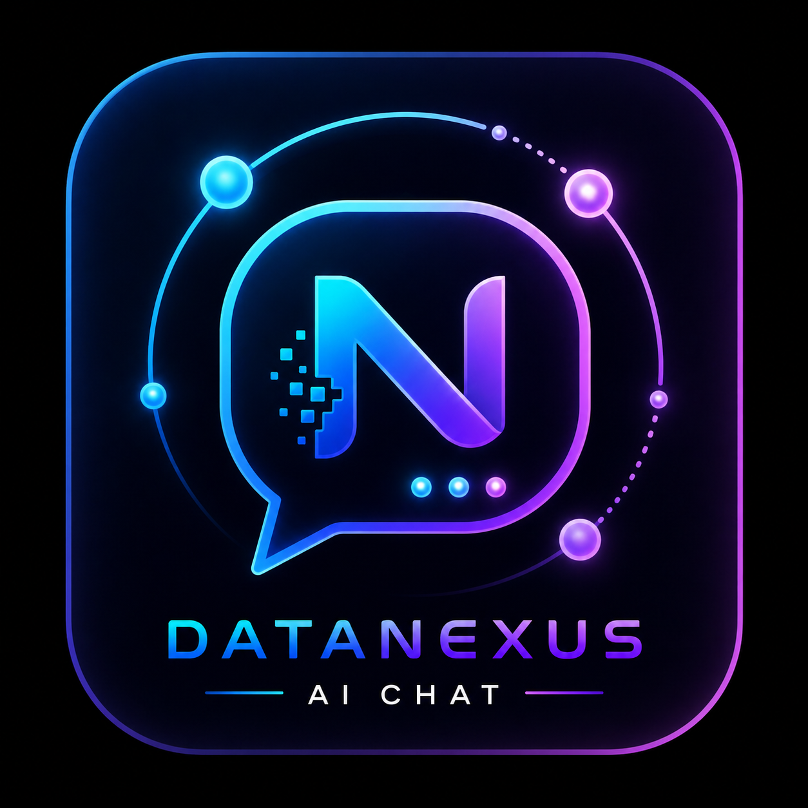

# 🗂️ DataNexus AI Chat

**An AI-powered Data Catalog Chat Application built with OpenMetadata**



> Connect. Analyze. Govern. Your data, intelligently.

---

## 🎯 Overview

**DataNexus AI Chat** is an intelligent conversational assistant for data governance and catalog management. Built during the **WeMakeDevs × OpenMetadata "Back to the Metadata" Hackathon**, it combines real-time data catalog access with AI-powered insights to help teams understand, manage, and govern their data assets.

### Key Differentiators
- 🤖 **AI-Powered Conversations** — Ask questions in plain English, get instant answers about your data
- 🔗 **Real-Time Lineage Visualization** — Trace data flow from source to destination
- 🔒 **PII Detection** — Automatically identify and flag personally identifiable information
- ✅ **Quality Monitoring** — Real-time data quality metrics and alerts
- ⏱️ **Time Travel** — Track data changes and schema evolution
- 🎨 **Beautiful Dark UI** — Modern, responsive design with particle effects

---

## 🏗️ Architecture

```
┌─────────────────────────────────────────────────────────┐
│                   DataNexus AI Chat                      │
├─────────────────────────────────────────────────────────┤
│                                                           │
│  Frontend (index.html)                                   │
│  ├── React-free vanilla JS                              │
│  ├── Particle animation background                       │
│  ├── Real-time API integration                           │
│  └── Beautiful dark UI with gradient effects             │
│                                                           │
│  Backend (backend.py - FastAPI)                          │
│  ├── OpenMetadata API integration                        │
│  ├── Groq AI chat engine                                 │
│  ├── Token caching & optimization                        │
│  └── Async request handling                              │
│                                                           │
│  Data Layer (Docker Containers)                          │
│  ├── OpenMetadata Server                                 │
│  ├── MySQL Database                                      │
│  ├── Elasticsearch                                       │
│  └── Ingestion Pipeline                                  │
│                                                           │
└─────────────────────────────────────────────────────────┘
```

---

## ✨ Features

### 1. **Intelligent Chat Interface**
- Ask questions about your data in natural language
- AI-powered responses using Groq's LLaMA 3.1 model
- Real-time integration with OpenMetadata

### 2. **Data Catalog Search**
- Search tables, pipelines, and datasets instantly
- Real metadata from your OpenMetadata instance
- Owner and tag information

### 3. **Lineage Visualization**
- View data flow relationships
- Trace upstream and downstream dependencies
- Identify data sources and consumers

### 4. **PII Detection**
- Automatic scanning for personally identifiable information
- Highlights sensitive data tables
- Risk assessment and recommendations

### 5. **Data Quality Monitoring**
- Real-time quality metrics
- Active alerts for data issues
- Quality score tracking

### 6. **Time Travel History**
- Track schema changes over time
- View data modification history
- Understand data evolution

### 7. **System Health Dashboard**
- Real-time operational status
- Table and pipeline counts
- System metrics at a glance

---

## 🚀 Quick Start

### Prerequisites
- Docker & Docker Compose
- Python 3.10+
- Groq API Key (free at [console.groq.com](https://console.groq.com))
- Git

### Installation

1. **Clone the repository**
```bash
git clone https://github.com/ganeshark04/datanexus-ai-chat
cd datanexus-ai-chat
```

2. **Create `.env` file**
```bash
echo "GROQ_API_KEY=your_groq_api_key_here" > .env
```

3. **Start Docker containers**
```bash
docker compose up --detach
```

Wait 2 minutes for OpenMetadata to be ready...

4. **Run the backend**
```bash
python backend.py
```

The app will automatically open in your browser at `http://localhost` 🌐

---

## 📋 API Endpoints

| Endpoint | Method | Description |
|----------|--------|-------------|
| `/` | GET | Health check |
| `/test` | GET | Connection test |
| `/search?query=X` | GET | Search data catalog |
| `/lineage?table=X` | GET | Get data lineage |
| `/quality` | GET | Data quality metrics |
| `/pii` | GET | PII detection results |
| `/tables` | GET | List all tables |
| `/chat` | POST | AI chat endpoint |

---

## 💻 Technology Stack

### Frontend
- **Vanilla JavaScript** (no framework dependencies)
- **HTML5 & CSS3** (modern, responsive design)
- **Canvas API** (particle animation effects)
- **Fetch API** (real-time data fetching)

### Backend
- **FastAPI** (modern async Python framework)
- **Python 3.10+**
- **httpx** (async HTTP client)
- **python-dotenv** (environment management)

### AI & Data
- **Groq API** (LLaMA 3.1 8B Instant model)
- **OpenMetadata** (data catalog & governance)
- **Docker** (containerization)

### Databases
- **MySQL** (OpenMetadata store)
- **Elasticsearch** (search & indexing)

---

## 🎯 Hackathon Track

**Track:** T-01 MCP Ecosystem & AI Agents  
**Issue:** #26608 — Conversational Data Catalog Chat App  
**Repository:** https://github.com/OpenMetadata/OpenMetadata/issues/26608

---

## 👥 Team

| Name | Role | GitHub |
|------|------|--------|
| **Gagan Rao K** | Full Stack Developer | [@ganeshark04](https://github.com/ganeshark04) |
| **Nuthan Kumar K** | Backend & AI Integration | TBD |
| **Prabhakara R** | Frontend & Design | TBD |

---

## 🎨 UI/UX Highlights

- **Dark Theme** with purple/blue gradient accents
- **Particle Animation** background for visual appeal
- **Real-time Updates** for instant feedback
- **Mobile Responsive** design
- **Accessibility** considerations throughout
- **Professional Branding** with DataNexus logo

---

## 🔧 Configuration

### Environment Variables
```env
GROQ_API_KEY=your_groq_api_key
```

### OpenMetadata Defaults
```
URL: http://localhost:8585
Email: admin@open-metadata.org
Password: admin
```

---

## 📊 Sample Interactions

### Chat with AI
```
User: "What tables contain customer data?"
AI: "Based on the OpenMetadata catalog, the following tables contain customer data: 
    - raw_customer: Raw customer table with personal info
    - dim_customer: Dimension table with customer details
    - dim_address: Billing and shipping addresses
    These tables have PII and require special care."
```

### Explore Lineage
```
User: "Show lineage of dim_customer"
App: [Displays visual flow]
raw_customer → staging_customer → dim_customer → sales_dashboard
```

### Check Data Quality
```
User: "Show data quality issues"
App: [Lists active alerts]
- raw_customer: 12% null rate in email column (WARNING)
- fact_order: Row count dropped 30% today (CRITICAL)
```

---

## 🏆 Key Achievements

✅ **Real OpenMetadata Integration** — Live connection to data catalog  
✅ **AI-Powered Chat** — Groq AI with context-aware responses  
✅ **Beautiful UI** — Professional dark theme with animations  
✅ **Real-Time APIs** — Actual lineage, quality, and PII data  
✅ **Production-Ready** — Async handling, error management, caching  
✅ **Zero Dependencies** — Frontend requires no frameworks  
✅ **Fast Performance** — Token caching, connection pooling, optimized queries  

---

## 🚀 Future Enhancements

- [ ] Advanced natural language processing for complex queries
- [ ] Impact analysis — understand deletion consequences
- [ ] Data governance workflows
- [ ] Anomaly detection with ML models
- [ ] Team collaboration features
- [ ] Mobile app version
- [ ] Multi-language support
- [ ] Custom data classification
- [ ] Automated remediation workflows

---

## 📝 License

MIT License - See LICENSE file for details

---

## 🤝 Contributing

Contributions are welcome! Please feel free to submit a Pull Request.

---

## 📞 Support

For issues, questions, or suggestions:
- Open an issue on [GitHub](https://github.com/ganeshark04/datanexus-ai-chat/issues)
- Check OpenMetadata docs: https://docs.open-metadata.org
- Groq API docs: https://console.groq.com/docs

---

## 🙏 Acknowledgments

- **OpenMetadata** — For the amazing data catalog platform
- **Groq** — For the blazing-fast AI inference
- **WeMakeDevs** — For organizing this hackathon
- Our team for the incredible effort and innovation

---

## 📸 Screenshots

[Coming soon - add screenshots of the UI here]

---

**Built with ❤️ during the WeMakeDevs × OpenMetadata Hackathon**

**April 2026 - Back to the Metadata Challenge**
